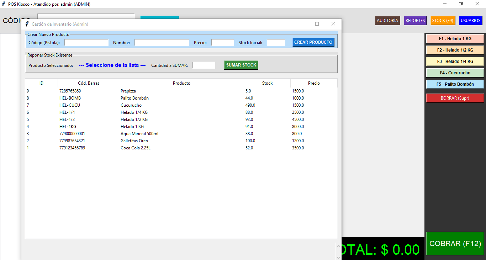

# 🛒 Sistema POS Kiosco (Python + Tkinter + SQLite)




Un sistema completo de Punto de Venta (POS) diseñado para pequeños comercios (kioscos, despensas). Incluye gestión de stock, usuarios con roles, reportes de ventas y logs de auditoría.

---

## ⚠️ AVISO LEGAL Y CONDICIONES DE USO

**Copyright © 2026 Ariel Artur de la Villarmois. Todos los derechos reservados.**

Este proyecto se libera como **CÓDIGO ABIERTO** con fines educativos y de portafolio profesional bajo la licencia **GNU GPLv3**.

### 🚫 Restricciones Comerciales
El código fuente disponible en este repositorio contiene una **Lógica de Demostración** limitada a 20 ventas. 

1. **Uso Educativo:** Eres libre de descargar, leer y modificar este código para aprender.
2. **Uso Comercial:** Queda estrictamente **prohibido** utilizar este software en un entorno comercial real (negocio) sin adquirir una licencia de uso.
3. **Modificación:** La alteración del código fuente para evadir, eliminar o manipular los límites de ventas ("cracking") para uso comercial constituye una violación de los derechos de autor y de la licencia de software.

> **¿Quieres usar este sistema en tu negocio sin límites?**
> Por favor, contacta al desarrollador para adquirir la versión **PRO** (Ejecutable sin restricciones + Soporte Técnico).
>
> 📧 **Contacto:** [ardeco9091@gmail.com]
> 💼 **LinkedIn:** [https://www.linkedin.com/in/ariel-artur-de-la-villarmois-informatica/]

---

## 🚀 Características del Sistema

* **Ventas Rápidas:** Interfaz optimizada con teclas rápidas (F1-F12).
* **Control de Stock:** Descuento automático de inventario y alertas de stock bajo.
* **Seguridad:** Login de usuarios (Admin/Cajero) y logs de auditoría (quién borró qué).
* **Reportes:** Dashboard gerencial con "Productos más vendidos" y "Ventas del día".
* **Base de Datos:** SQLite local (no requiere servidor).


## 🛠️ Instalación y Prueba (Modo Desarrollador)

Si eres programador y quieres probar el código:

1. Clonar el repositorio:
   ```bash
   git clone [https://github.com/](https://github.com/)[ardeco9091]/sistema-pos-kiosco.git

   Requisitos:

Tener instalado Python 3.x.

Las librerías utilizadas (tkinter, sqlite3, datetime) vienen incluidas por defecto en Python, por lo que no necesitas instalar nada extra con pip.

Inicializar la Base de Datos (Importante): Antes de abrir el sistema, ejecuta este script para crear las tablas y el usuario Admin por defecto:

Bash

python inicializar_db.py
(Esto creará el archivo negocio.db)

Ejecutar el Sistema:

Bash

python main.py
Usuario: admin

Clave: 1234

📦 Descarga para Usuarios (Demo Ejecutable)
Si no eres programador y solo quieres probar el programa, no necesitas descargar el código. Ve a la sección de [Releases] de este repositorio (a la derecha) y descarga el archivo .exe listo para usar.


---


```markdown

